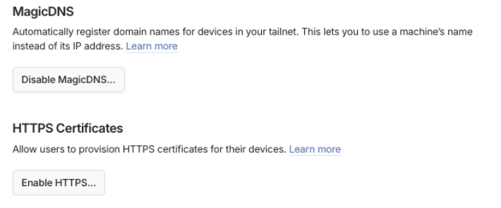
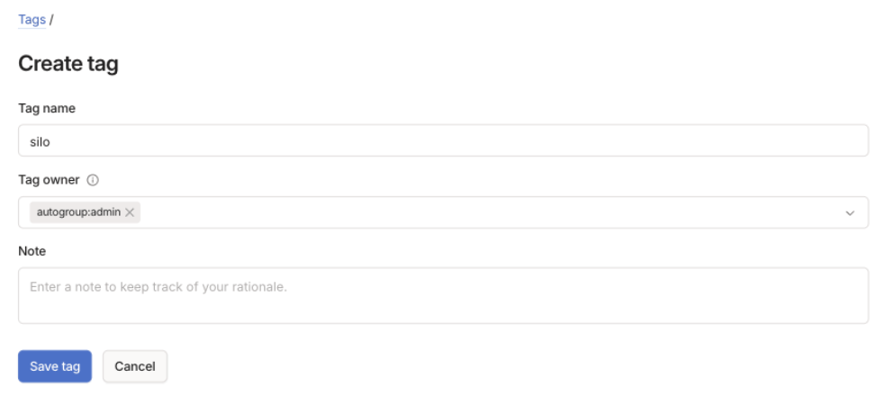
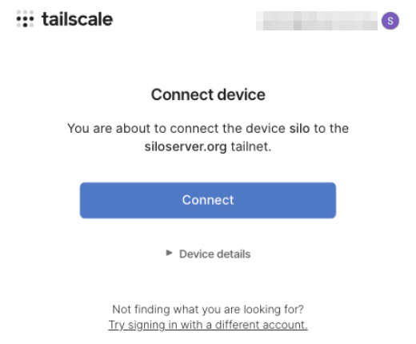
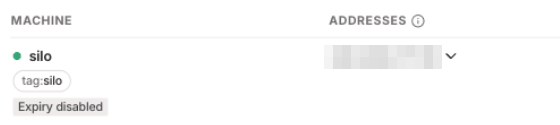

:::caution[Beta]
This feature is in Beta and may change or be removed in a future release.
:::

The Tailscale plugin adds your Silo server to your Tailscale network
(tailnet). Devices signed in to the same tailnet reach the server at an
HTTPS address, with no port forwarding or public reverse proxy. The plugin
runs its own Tailscale node inside Silo, so the server doesn't need the
Tailscale app. The plugin is an approved community plugin, maintained by
community contributors rather than the Silo project.

## Before you start

In the Tailscale admin console, open **DNS**. Check that **MagicDNS** is on,
as it is for new tailnets. Under **HTTPS Certificates**, select **Enable
HTTPS...** and confirm. The server can't get an HTTPS address without both.

Tailscale records the certificate's name in public Certificate Transparency
logs, so choose a hostname you don't mind being public.

To tag the server, which the [Tailscale sign-in](/docs/tailscale-sign-in)
examples assume, create the tag before you connect it:

1. Open **Access controls > Definitions** and select the **Tags** tab.
2. Select **Create tag**. Enter `silo` as the **Tag name**, choose a **Tag
   owner** such as `autogroup:admin`, and select **Save tag**.

Tailscale turns off key expiry for tagged devices, so a tagged server
doesn't need to be approved again later.

## Install the plugin

1. With an administrator account, open **Admin > Plugins** and select the
   **Catalog** tab.
2. Turn on **Include approved community plugins**.
3. Find **Tailscale** under **Approved community** and select **Install**.
4. Open the installed plugin and fill in its settings, then select
   **Save config**:
   - **Hostname** is the server's name on your tailnet. The default is `silo`.
   - **Auth key** is optional. Without one, you approve the server in your
     browser in the next section. Use a reusable key if you also run proxy
     nodes, so each one enrolls on its own.
   - **Tags** is optional, for example `tag:silo`. Your tailnet policy or
     auth key must allow the tags.
   - **Discovery** is on by default. The server also answers on port `80`,
     only to redirect to its HTTPS address, so Silo apps on your tailnet can
     find it by its short name.

The plugin serves Silo only on your tailnet. To reach Silo from the public
internet, use a [reverse proxy](/docs/reverse-proxy).

## Connect the server

1. Open **Admin > Settings > Network Access**.
2. Under **Tailscale**, select **Connect** on the row for your server.
3. If the row shows **Waiting for authorization**, select **Open the
   authorization page**, sign in to Tailscale, and select **Connect**. With a
   saved auth key, this step is skipped.

   

4. Wait for **Connected**. The row then shows the address clients use, after
   **Clients reach this host at**.

The server also appears on the **Machines** page of the Tailscale admin
console, with its tag if you set one.

Proxy nodes appear as their own rows, named `<hostname>-proxy-<node id>`.

## Connect your devices

Install the Tailscale app on each device and sign in to the same tailnet.
Then add the server in the Silo app using the address from the Network
Access page, for example `https://silo.example-tailnet.ts.net`. Tailscale may
add a suffix if the name is taken, so copy the address from the page.

Jellyfin-compatible apps use the same name on port `8096`, and
Audiobookshelf apps use port `13378`, when those endpoints are turned on.
Your tailnet access policy must allow ports `443`, `8096`, and `13378` for
the devices that connect, and port `80` if **Discovery** is on.

To share the server with people outside your tailnet and let them sign in
without a password, see [Sign in with Tailscale](/docs/tailscale-sign-in).

## If it doesn't connect

When a row shows **Error**, the message under it gives the reason:

- If it asks you to enable MagicDNS or HTTPS certificates in the Tailscale
  admin console, turn that option on, then select **Connect** again.
- If it says **Joined tailnet; HTTPS is not ready**, the server is waiting
  for its certificate. The plugin retries on its own.

If the row shows **Plugin not running**, start the plugin from its page
under **Admin > Plugins**.

For plugin problems, use the plugin's
[GitHub issues](https://github.com/Silo-Community/silo-plugin-tailscale/issues).
