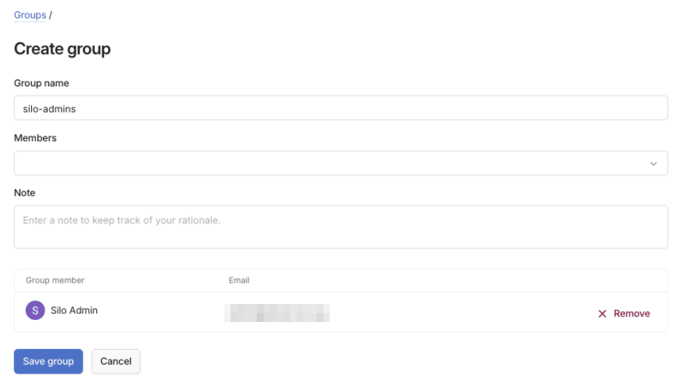
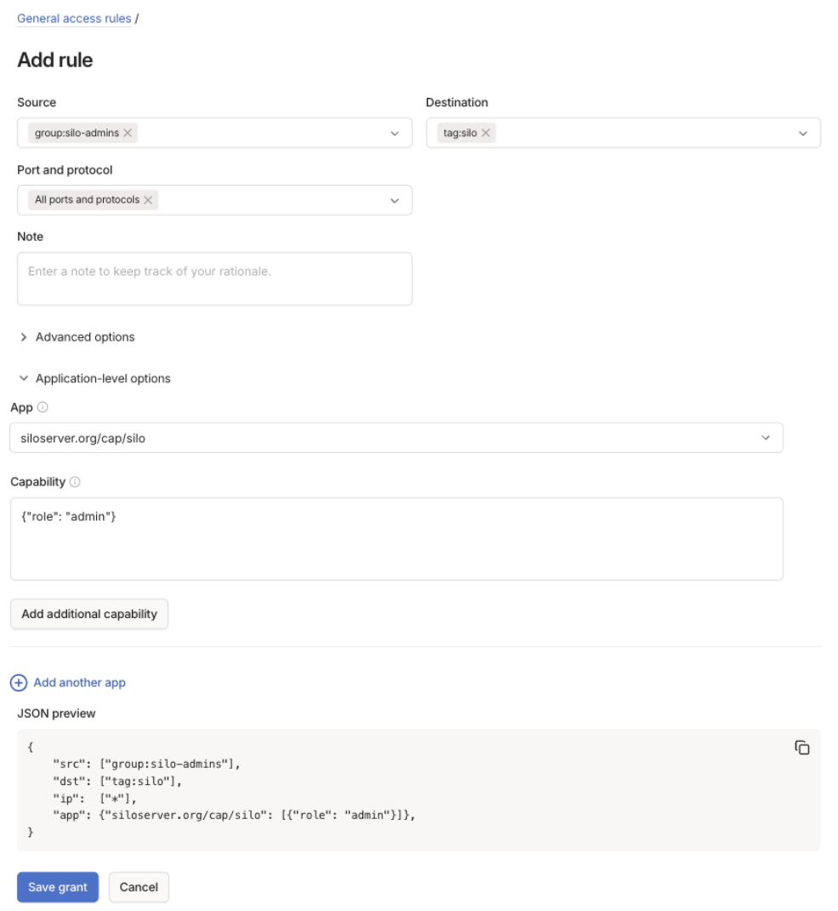
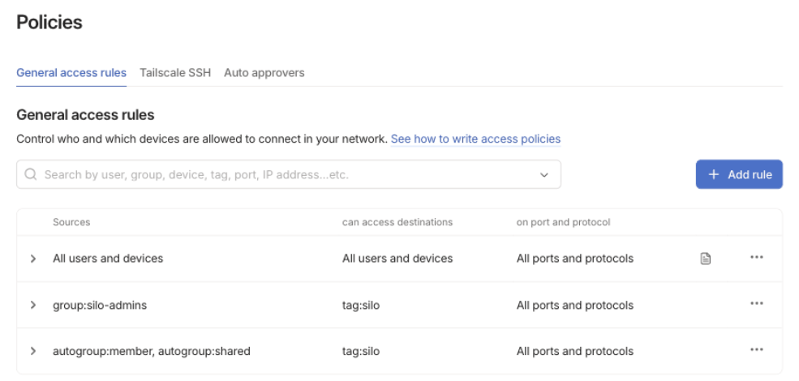
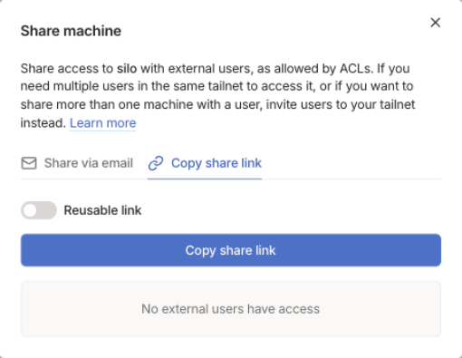

:::caution[Beta]
This feature is in Beta and may change or be removed in a future release.
:::

People whose device reaches your server over Tailscale can sign in without a
password. The sign-in screen shows **Continue as** with the name of whoever is
signed in to Tailscale on that device, and a TV signs in with one press,
without a code. Set it up in the web app as a server administrator.

Family and friends outside your tailnet sign in the same way once you share
the server's Tailscale node with them: they install Tailscale on their
devices, open Silo, and press **Continue as**.

## Before you start

- Set up the Tailscale plugin and connect the server as described in
  [Reach your server with Tailscale](/docs/tailscale). Tailscale sign-in
  requires plugin version 0.2.0 or later.
- Read [Who Silo signs in](#who-silo-signs-in). Silo signs in whoever is
  signed in to Tailscale on the device, which matters for shared TVs and for
  devices that relay other people's traffic.

## Turn on Tailscale sign-in

1. Open **Admin > Settings > Sign-in**.
2. Under **Network sign-in**, turn on **Sign in with Tailscale**. This
   section appears only while the Tailscale plugin is installed.
3. Leave **Create accounts on first sign-in** on if new people should get a
   Silo account the first time they press **Continue as**. Turn it off to
   let in only accounts that are already
   [connected to Tailscale](#connect-tailscale-to-an-existing-account).

Both switches apply at once. Tailscale sign-in works beside an OpenID Connect
or LDAP provider and doesn't change whether Silo passwords work.

A new account gets the **User** role unless a [grant](#set-roles-with-grants)
makes the person an admin. Its username is usually the part of the person's
Tailscale login name before the `@`.

## Choose who can sign in

Open the Tailscale plugin under **Admin > Plugins**, set **Who can sign in**,
and select **Save config**. Saving restarts the plugin.

- **Anyone who can reach Silo over Tailscale**, the default, lets in every
  untagged device that reaches the server, including people you share it
  with.
- **Only people granted siloserver.org/cap/silo** lets in only people your
  tailnet policy grants that capability.

## Set roles with grants

Grants in your tailnet policy can set each person's Silo role. Add them with
the visual policy editor in the Tailscale admin console. These steps assume
you [tagged the server](/docs/tailscale#before-you-start) `tag:silo`.
They make members of a `silo-admins` group Silo admins, and everyone else,
including people you share the server with, regular users.

1. Open **Access controls > Definitions**. On the **Groups** tab, select
   **Create group**. Enter `silo-admins` as the **Group name**, add the
   people who should be Silo admins under **Members**, and select **Save
   group**.

   

2. Open **Access controls > Policies**. On the **General access rules** tab,
   select **Add rule**.
3. Set **Source** to `group:silo-admins` and **Destination** to `tag:silo`.
   Leave **Port and protocol** at **All ports and protocols**.
4. Expand **Application-level options**. Enter `siloserver.org/cap/silo` as
   the **App** and `{"role": "admin"}` as the **Capability**, then select
   **Save grant**.

   

5. Select **Add rule** again. Set **Source** to `autogroup:member` and
   `autogroup:shared`, and **Destination** to `tag:silo`. Under
   **Application-level options**, enter `siloserver.org/cap/silo` as the
   **App** and `{"role": "user"}` as the **Capability**, then select **Save
   grant**.

The **General access rules** tab then lists both rules. Each rule's **JSON
preview** shows how it appears in the policy file, if you edit that instead.

How Silo reads these grants:

- `{"role": "admin"}` makes the person a Silo admin. `{"role": "user"}` or
  `{}` makes them a regular user. Any other value, such as
  `{"role": "Admin"}`, grants nothing.
- A person's role is the highest one granted to any of their devices.
- Without a grant, Silo leaves the role as it is. Removing someone's admin
  grant doesn't demote them, so grant them `{"role": "user"}` instead.
- Policy changes apply at the person's next sign-in or access re-check.
- An account that also signs in through your OpenID Connect or LDAP provider
  takes its role from that provider.

Anyone who can edit your tailnet policy can make themselves a Silo admin.

## Share your server with family and friends

Tailscale's machine sharing lets someone outside your tailnet reach the Silo
node and nothing else. They don't join your tailnet. People who are already
members of your tailnet don't need a share. A share covers one machine; to
give someone more than one, Tailscale suggests inviting them to your tailnet
instead.

### What you do

1. In the Tailscale admin console, open **Machines** and select **Share...**
   next to the Silo machine, which is named after the plugin's **Hostname**.
2. Select **Share via email** and enter their addresses, or select **Copy
   share link** and send the link yourself. Turn on **Reusable link** to send
   one link to several people. Unused links expire after 30 days.

   

3. If you added the rules in [Set roles with grants](#set-roles-with-grants),
   people you share the server with can already reach it. Otherwise, if your
   tailnet policy doesn't allow all traffic, add a rule with **Source**
   `autogroup:shared` and **Destination** `tag:silo`. If **Who can sign in**
   requires a grant, give that rule the `siloserver.org/cap/silo` capability
   too.
4. Send them the server address from **Admin > Settings > Network Access**,
   for example `https://silo.example-tailnet.ts.net`. A shared machine
   answers only to its full name, so the short hostname won't work.

### What they do

1. Sign in to Tailscale, or create an account, and accept the invite.
   Tailscale requires the person who accepts to be an admin of their own
   tailnet. Someone who created their own Tailscale account is.
2. Install the Tailscale app on each device they'll watch on, including the
   TV, and sign in with the account that accepted the invite. Only that
   account's devices can reach your server.
3. Open Silo, enter the server address, and select **Continue as**.

The first press creates their Silo account, if **Create accounts on first
sign-in** is on. After that, every device signed in to the same Tailscale
account signs in to the same Silo account.

## What people see

**Continue as** appears only when the device is connected to Tailscale and
Silo is opened at the server's Tailscale address. It shows the name of the
person signed in to Tailscale, with **via Tailscale** underneath.

| App | Where **Continue as** appears |
| --- | --- |
| Web app | At the top of the sign-in page. If Silo passwords are off and there's no LDAP provider, the password form is hidden. |
| Mobile | At the top of the sign-in screen, above the password form. |
| TV | On the sign-in screen, above the code, QR code, and password options. It's usually selected when the screen opens; if not, move up to it. |

## Connect Tailscale to an existing account

If someone already has a Silo account, connect it to Tailscale before they
press **Continue as**. Otherwise Silo creates a second account for them when
**Create accounts on first sign-in** is on, or refuses with "An account with
your email already exists" when their Tailscale login is that account's
email.

1. On a device connected to Tailscale, open Silo at the server's Tailscale
   address and sign in with the account's password. **Connect Tailscale**
   appears only when Silo is open at that address.
2. In the web app, open **Settings > Account** and find the **Sign-in**
   section. In the mobile app, open **Settings** and go to **Sign-in**.
3. Select **Connect Tailscale**, enter the Silo password, and select
   **Connect**.

After that, the account signs in with Tailscale instead of its password. The
password stops working everywhere, including on a public address and in
Jellyfin-compatible apps. Don't connect an account that still needs to sign
in from outside Tailscale. Admin accounts marked **Break-glass account**,
which includes the server owner by default, keep their password. To turn an
account's password back on, set a new password for it as an administrator.

The TV app has no connect option; use the mobile or web app. An account that signs
in only through OpenID Connect or LDAP has no Silo password to confirm, so it
can't connect Tailscale this way.

## Who Silo signs in

Silo signs in whoever is signed in to Tailscale on the device, with that
person's role.

- Everyone using a shared TV signs in as the person who signed the TV in to
  Tailscale. Sign shared TVs in to Tailscale as someone without an admin
  grant, and use [profiles](/docs/profiles) to keep each viewer's watching
  separate.
- Someone using a device signed in to Tailscale as another person can
  connect that person's Tailscale identity to their own Silo account.
- A device that forwards other people's traffic to Silo, such as a reverse
  proxy, a NAT or Docker host, or Tailscale Serve on another machine, makes
  everyone behind it look like its owner. Tag every device that relays
  traffic to Silo; tagged devices never sign in.
- A subnet router signs in as its owner, like any other device. Devices on
  the LAN behind it keep their own addresses and get no **Continue as**. If
  one of your routers rewrites forwarded LAN traffic to its own Tailscale
  address, set the plugin's **Subnet routers** to **Cannot sign in**. Exit
  nodes aren't affected.
- Tagged devices never sign in this way, so don't tag the phones, tablets,
  and TVs people watch on.

## Remove someone's access

- Revoke their share, or remove them from your tailnet, in the Tailscale
  admin console. Their devices can no longer reach the server.
- If your server also has a public address, Silo signs them out at its next
  access re-check. The default is every 12 hours; change it with **Re-check
  access every**, under **Accounts and sessions** on **Admin > Settings >
  Sign-in**.
- If **Who can sign in** requires a grant, removing their grant stops new
  sign-ins, and the next re-check signs them out.
- Turning off **Sign in with Tailscale** hides **Continue as**. Accounts and
  their Tailscale connections stay, but people whose accounts have no Silo
  password can't sign in again until you turn it back on or set a password
  for them.

## Limits

- Jellyfin-compatible and Audiobookshelf apps can't use Tailscale sign-in;
  they still sign in with a username and password. Accounts that Tailscale
  sign-in creates start without a Silo password.
- Tailscale sign-in doesn't count as a replacement for passwords. Turning
  off **Allow password sign-in** still requires an OpenID Connect or LDAP
  provider.
- If you move the Silo node to another tailnet, Silo stops recognizing the
  Tailscale connections made in the old one.

## If Continue as doesn't appear

**Continue as** appears only when all of these are true:

- The device's Tailscale app is connected.
- Silo is open at the server's Tailscale address, not a LAN or public address.
- **Sign in with Tailscale** is on.
- The device isn't tagged, and its Tailscale key hasn't expired.
- The device isn't a subnet router while **Subnet routers** is set to
  **Cannot sign in**.
- The request doesn't pass through a proxy.
- If **Who can sign in** requires a grant, the person holds a
  `siloserver.org/cap/silo` grant.

If a TV you set up from your phone says it can't reach the server through
Tailscale, open the Tailscale app on the TV and check that it's signed in to
an account that can reach the server.

When the button is there but sign-in fails, the message says why:

| Message | What it means |
| --- | --- |
| **Open this server at its Tailscale address to sign in this way.** | The device reached Silo some other way. Use the address from **Admin > Settings > Network Access**. |
| **Tailscale doesn't allow this device …** | Your OpenID Connect or LDAP provider refused the account, or your tailnet policy changed a moment ago. |
| **You don't have an account on this server yet.** | **Create accounts on first sign-in** is off and the account isn't connected to Tailscale yet. [Connect it](#connect-tailscale-to-an-existing-account) or turn the setting on. |
| **An account with your email already exists.** | Sign in with the password and [connect the account](#connect-tailscale-to-an-existing-account). |

For plugin problems, use the plugin's
[GitHub issues](https://github.com/Silo-Community/silo-plugin-tailscale/issues).
